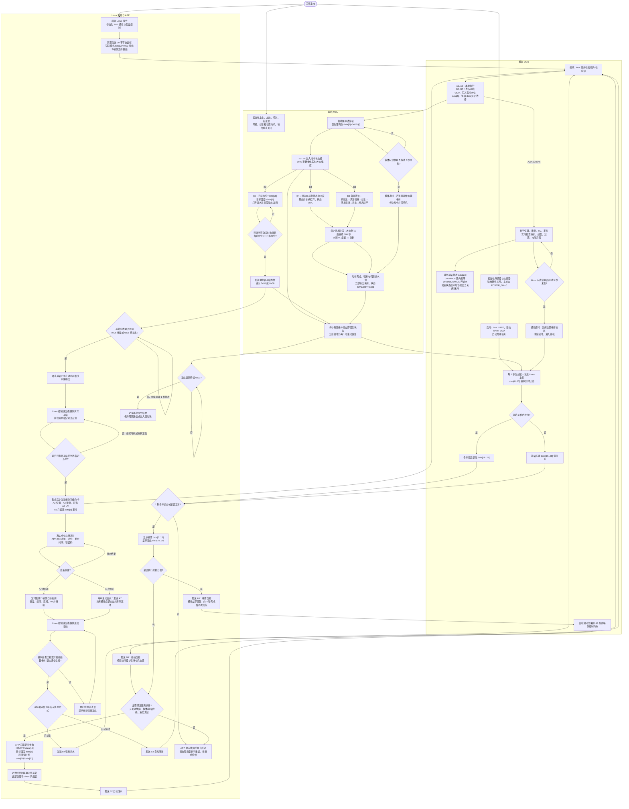
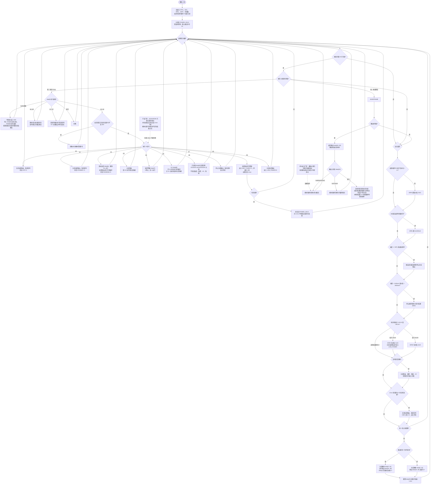
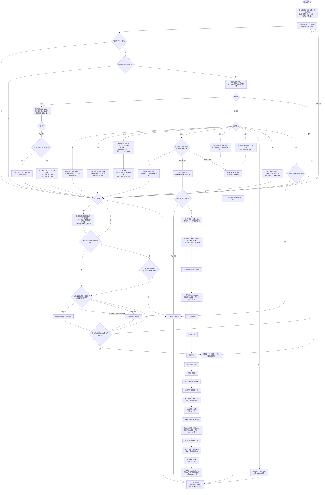

# 智能足浴机器人三端业务逻辑流程图

> 依据当前桶体工程 `Foot_bath_robot_V1`、基站工程 `Foot_bath_robot_base_V2` 代码整理。  
> 本文只描述当前已经实现的逻辑；Linux 主控的 APP、底盘运动和任务调度细节未包含在两个 MCU 工程中，因此在总流程图中以“产品层决策”表示。

## 一、Linux 主控、桶体、基站：开机到洗脚结束

## 阅读方法

- 圆角框表示开始或结束，矩形表示执行动作，菱形表示条件判断。
- 箭头上的 A2、B2、0x07 表示触发路径的命令或状态。
- 回环表示 MCU 周期任务持续检查条件，并不表示程序卡住。
- 第一次阅读先看“上电 → 注水 → 足浴 → 结束处理 → 待机”主线，再看故障分支。

### 这张图讲什么

第一张图按 Linux 主控、桶体 MCU、基站 MCU 三条泳道展开。主业务链是：

**三端上电 → 建立通信 → 可选自检 → APP 设置参数 → B2 自动注水 → A 类命令启动足浴 → A7 或定时结束 → B4 排水或 B3 自动清洁 → 基站回到 0x03 待机。**

- **Linux 主控是决策者**：接收 APP 操作、组织命令、判断能否进入下一阶段。
- **桶体是通信中转和足浴执行端**：离站到达指定点位后执行恒温、按摩、UV 和水位检测，并透传 B 类命令。
- **基站是水路和清洁执行端**：桶体对接基站时负责进水、排水、喷淋、药液、加热和烘干。
- 桶体将自身数据和基站数据合并后，每秒上传 Linux。

### 正常业务示例

假设目标水位 8L、目标温度 42℃、足浴 20 分钟：

1. Linux 持续发送有效帧，桶体以透传模式连接基站。
2. Linux 下发 B2：`data[16]=8`、`data[6]=42`；桶体将其透传给基站。
3. 基站打开进水和按需加热；Linux 继续发送 `0x00` 摸鱼帧。
4. 桶体把实际水位写入 `data[5]`、实际温度写入 `data[6]`，再转给基站。
5. 水位达到 8L 后，基站关闭进水和加热，进入 `0x05` 或 `0x06`。
6. Linux 确认注水完成，再发送 A2、A4、A6。
7. 基站关闭进水后，Linux 控制底盘携桶体离开基站并前往指定点位。
8. Linux 确认已离站并到点后，才发送 A2、A4、A6；桶体开始恒温、按摩和倒计时。
9. 足浴结束后桶体关闭输出，Linux 控制底盘返回并重新对接基站。
10. 只有确认物理对接且桶体-基站通信在线后，Linux 才能发送 B4 排水或 B3 自动清洁。
11. 基站回到 `data[23]=0x03` 后，本次服务完成。

### 三条异常主线

- **Linux 断联**：桶体 5 秒无有效 Linux 帧，关闭输出并待机。
- **桶体看不到基站**：3 秒无基站状态，`data[16..28]` 清零。
- **基站看不到桶体**：5 秒无桶体有效帧，依赖桶体的动作会被中止。

### 总流程关键约束

- Linux 到桶体使用固定 30 字节帧；`data[2]=0x02` 才是当前三端透传模式。
- 桶体常规上报 Linux 每 1 秒一帧；桶体自检开始和完成保留即时单独回包。
- 基站在线时，桶体将最近基站 `data[16..28]` 合并到周期帧；基站超过 3 秒无状态帧时，该区域清零。
- Linux 超过 5 秒没有给桶体有效帧，桶体关闭所有输出；基站超过 5 秒没有收到桶体有效帧，会中止依赖桶体的动作。
- B2 是否完成只使用实时摸鱼帧中的 `data[5]` 水位判断；目标水位只取 B2 的 `data[16]`。

## 二、桶体业务逻辑流程图

### 这张图讲什么

第二张图是桶体周期任务形成的循环，不是一次走完的线性流程：

1. **收命令**：区分 A 类桶体命令、B 类基站命令、`0x00` 摸鱼命令和系统命令。
2. **控外设**：控制恒温、按摩电机、UV 和泵阀。
3. **做保护**：检查缺水、传感器、超温、加热超时、过流和电池异常。
4. **发状态**：每秒生成桶体与基站合并状态发给 Linux。

阅读时先从 `data[3]` 命令类型找到对应命令，再看动作回到周期循环后受到哪些保护条件约束。

### 桶体业务位置前置条件

- 恒温、按摩、UV 和足浴定时属于离站服务功能，只能在 Linux 确认桶体离开基站并到达指定点位后下发。
- 排水属于在站功能，必须先返回并物理对接基站，确认桶体-基站通信在线后执行。
- 当前桶体 MCU 没有底盘点位字段，收到 A2/A4 等命令仍会直接执行，因此位置门禁目前必须由 Linux 保证。

### 如何理解桶体命令

- A0、A1、A7、A9 是整体状态命令，会影响多个输出。
- A2/A3 控制恒温；A2 需要内循环，A3 关闭恒温后只有 UV 也关闭时才释放循环。
- A4 控制按摩，等级来自 `data[7]`；A5 控制 UV，UV 工作需要内循环。
- A6 只读取 `data[9]` 设置时间，不改变其它外设。
- A8 自检期间其它 A 类命令被忽略，并保留开始、完成两次即时上报。
- B 类命令原则上由桶体透传给基站执行。

### 泵阀优先级

1. 基站状态 `0x08/0x0A/0x0C`：桶体切到排水。
2. 基站状态 `0x07/0x09`：桶体切到内循环。
3. 离开上述阶段后，如果本地恒温或 UV 仍需要循环，就继续保持。
4. 定时到期、A7、低电压保护或 Linux 超时会关闭全部输出。

### 桶体上报

- `data[0..15]` 根据桶体实时状态生成。
- 基站在线时合并 `data[16..28]`；离线时该区域全为 0。
- 常规帧 `data[3]=0x00`；自检开始和完成是即时回包例外。

### 桶体任务与互斥重点

| 项目 | 当前代码行为 |
|---|---|
| 恒温控制 | 目标温度限制为 35～48℃；低于目标约 0.5℃开始加热，高于目标约 0.3℃停止加热 |
| 水位范围 | 协议水位最大 12L；需要水的功能在水位低于 1L 时产生缺水错误 |
| 泵阀互斥 | 泵阀只有关闭、内循环、排水三种模式，同一时刻不能同时内循环和排水 |
| 基站同步 | `0x07/0x09` 请求桶体内循环；`0x08/0x0A/0x0C` 请求桶体排水 |
| 定时命令 | A6 只设置时间；到期才统一关闭恒温、按摩、泵阀和 UV |
| 自检互斥 | 自检期间除 A8 外的 A 类桶体命令被忽略；自检开始和完成均有即时回包 |
| 常规上报 | 每秒一帧，正常周期帧 `data[3]=0x00`，不持续携带上一条命令 |

## 三、基站业务逻辑流程图

### 这张图讲什么

第三张图是基站的非阻塞状态机。收到 B 类命令后，基站记录当前动作、目标状态、截止时间和电机位置，再由周期任务推进阶段。

- 左上部分是通信入口：`0x00` 更新实时水位和温度，B0～B9 启动业务。
- 中间部分是 B2 自动注水和 B3 自动清洁。
- 下方部分是通信超时、缺液检查、动作计时和状态上报。

### 基站连接前置条件

- 注水、排水和自动清洁都属于在站动作，Linux 必须先确认桶体已与基站物理对接。
- 基站 MCU 当前能确认的是桶体通信在线，不能仅凭协议确认机械结构已经可靠对接；物理对接结果应由 Linux 的底盘/对接检测提供。
- 未确认连接时不得下发 B3、B4、B5、B6 等涉及水路的命令。

### 如何理解 B2 自动注水

- 目标水位取 B2 的 `data[16]`，目标温度取 `data[6]`。
- 药液泵时长取 `data[20]` 和 `data[21]`。
- 实际水位只取 `0x00` 帧的 `data[5]`，实际温度只取 `data[6]`。
- 收到有效实时数据且实际水位达到目标值，才判定注水完成。
- 所以 B2 发出后 Linux 仍要继续发送摸鱼帧。

### 如何理解 B3 自动清洁

1. **第一次排水 `0x0C`**：排残留水，桶体同步排水。
2. **清洁喷淋 `0x07`**：电机到 90°，桶体内循环，执行清水和两次清洁液。
3. **第二次排水 `0x08`**：排出清洁喷淋后的污水。
4. **清水喷淋 `0x09`**：再次冲洗，桶体同步内循环。
5. **第三次排水 `0x0A`**：排出清水喷淋后的水。
6. **热风烘干 `0x0B`**：关闭水路，开启风机和加热，结束后回到 `0x03`。

排水使用电机 0°，喷淋使用 90°；电机未到位或故障时不能推进。

### 排水结束条件

1. 正在排水、已收到有效水位，并检测到 `data[5]=0L`。
2. 检测到 0L 后，当前代码继续排水 100 秒。
3. 始终未检测到 0L 时，最长 10 分钟后结束该排水阶段。

### B4～B9

- B4 强制排水；B5 单独清洁喷淋；B6 单独清水喷淋；B7 单独烘干。
- B8 进入基站自检；B9 只中止自动清洁，不是通用停止命令。

### 基站状态码与桶体联动

| `data[23]` | 基站状态 | 桶体联动 |
|---:|---|---|
| `0x00` | 上电 | 无 |
| `0x01` | 自检 | 无 |
| `0x02` | 关闭 | 释放基站触发的泵阀动作 |
| `0x03` | 待机 | 释放基站触发的泵阀动作 |
| `0x04` | 自动注水 | 无强制泵阀同步 |
| `0x05` | 注水后保温 | 无强制泵阀同步 |
| `0x06` | 注水完成待排水 | 无强制泵阀同步 |
| `0x07` | 自动清洁喷淋 | 桶体内循环 |
| `0x08` | 清洁喷淋后排水 | 桶体排水 |
| `0x09` | 清水喷淋 | 桶体内循环 |
| `0x0A` | 清水喷淋后排水 | 桶体排水 |
| `0x0B` | 热风烘干 | 关闭基站触发的桶体泵阀动作 |
| `0x0C` | 首次/强制/单项后排水 | 桶体排水 |
| `0x0D` | 单独清洁喷淋 | 当前桶体代码不按此状态强制内循环 |
| `0x0E` | 单独清水喷淋 | 当前桶体代码不按此状态强制内循环 |
| `0x0F` | 单独烘干 | 无 |

## 四、当前实现中需要产品确认的边界

1. **新增业务门禁**：离站并到达指定点位后才能下发恒温、按摩等足浴命令；返回且确认物理对接基站后才能排水或清洁。当前两个 MCU 协议没有明确的底盘点位/机械对接字段，该门禁必须由 Linux 实现，或后续扩展协议。

2. 基站当前代码中，检测到 `0L` 后继续排水是 **100 秒**；如果产品要求是 30 秒，需要后续统一修改常量和测试标准。
3. 自动注水当前没有独立的最长注水超时；若水位数据始终小于目标值，进水可能持续，产品应补充超时和水位传感器失效策略。
4. B2 的目标水位若为 `0`，当前启动逻辑仍可能打开进水，应由 Linux 禁止下发或由基站增加参数合法性检查。
5. 基站 B8 自检当前进入 `0x01` 后没有清晰的自动完成计时和结果闭环，产品流程应定义完成条件、超时时间和退出命令。
6. 桶体只对基站 `0x07/0x09` 同步内循环；单独喷淋状态 `0x0D/0x0E` 当前不会触发桶体内循环，需要确认这是产品预期还是遗漏。
7. 桶体低水位当前会设置错误码，但不同外设模块的停机动作并不完全由同一个总开关完成；整机安全需求应明确哪些错误必须立即停止全部输出。

## Mermaid 预览

在 VS Code 中打开本文件后，使用 `Ctrl+Shift+V` 打开 Markdown 预览。Mermaid 插件通常只在 Markdown 预览页渲染，源码编辑页仍会显示代码块。
